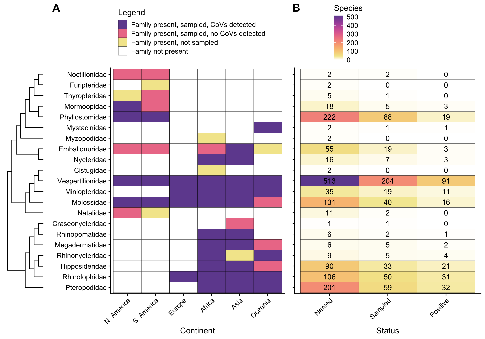

# bat_CoV_review
Files from Ruiz-Aravena et al (2021) Nat Rev Microbiol - Ecology, evolution, and spillover of coronaviruses from bats

Review includes all studies of coronaviruses in bats published before 8 October 2021.

Shape files for bat geographic ranges (and all other terrestrial mammals) are available from IUCN at https://www.iucnredlist.org/resources/spatial-data-download.

Additional large files available by request (mailto:clifton.mckee@gmail.com): 'mammterr.RData', 'MAMMALS_TERRESTRIAL_ONLY.shp'

